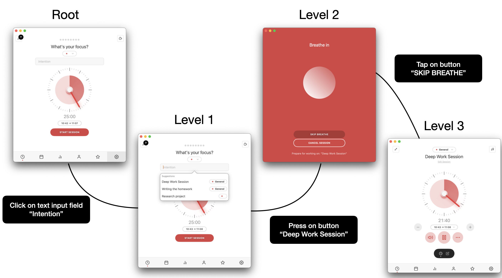
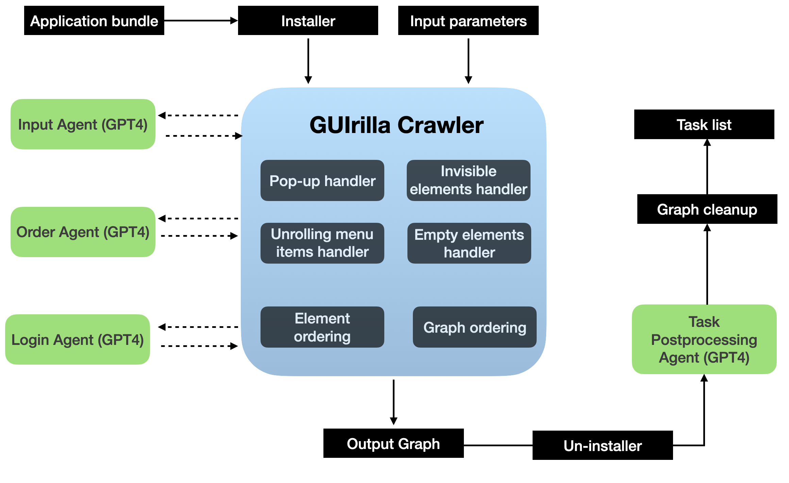

<h1>
  
  GUIrilla: A Scalable Framework for Automated Desktop UI Exploration
</h1>

This repository contains the codebase for the paper **"GUIrilla: A Scalable Framework for Automated Desktop UI Exploration"**. It implements a fully automated system for interacting with macOS applications and organizes the data about UI changes upon interaction in a graph.


---

## 🔧 Requirements

- **macOS**: Version 13.2 or later  
- **Python**: Version 3.11  
- **OpenAI API Key** *(optional)*: Set in `config_open_ai.env`  
  [Get your key here](https://platform.openai.com/account/api-keys)  
- **macOS System Pass Key**: Set in `config_system_pass.env`  
- **Mac App Store CLI (`mas`)** *(optional)*: Required for automatic app installation  
  - Install via [mas GitHub page](https://github.com/mas-cli/mas)  
  - Or run:  
    ```bash
    brew install mas
    ```
  - Then set `-m /Path/to/mas` to simply `mas`
    
---

## 🛡️ Accessibility Permissions

➡️ Ensure the Python interpreter has Accessibility access:

**System Settings > Privacy & Security > Accessibility**

Add the following:

- Terminal 
- Python (or your IDE, e.g., PyCharm or VS Code)  
- Any GUI runner you use

---

## ⚙️ Installation

```bash
python3.11 -m venv parser_venv
source parser_venv/bin/activate
pip install -r requirements.txt
chmod +x ./run_me.sh ./run_me_bulk.sh
```

---

## 🚀 Usage

### 🔹 Single App Processing

```bash
./run_me.sh -a 'Calculator,com.apple.calculator,,os' -o ./output -m /Path/to/mas -h False -c False -l False -q 1
```

### 🔹 Bulk App Processing

```bash
./run_me_bulk.sh -i app_details_small.txt -o ./output -m /Path/to/mas -l False
```

---

## ⚙️ Configuration Options



The crawler can be controlled via several flags to modify its behavior:

### 🧠 1. GPT-4 Assistance (Optional)

To use GPT-4 for input generation, element sorting and task generation, ensure an OpenAI API key is available.  
Disable it by setting `-l False`.
This will disable AI-based reasoning, falling back to deterministic inputs, element ordering and handling of login pages.

### 🖱️ 2. Cursor-Based Interaction

Enable cursor movements before actions using `-c True`.
This helps visualize element interactions, such as hover states, by showing cursor positioning as separate actions in the interaction graph.

### 🗂️ 3. Task Collection 

To **collect UI interaction data** without generating action descriptions, use `--tasks False`.
This is useful for building raw interaction graphs or debugging the UI crawling logic.

### 🕔 4. Maximal duration of parsing

The -q argument controls the maximal duration of time used by GUIrilla crawler for parsing.
It should be specified in minutes and is an upper boundary for processing a single application.

---

## 📁 Input Format

For bulk runs, provide an `app_details.txt` file formatted like:

```
Calculator,com.apple.calculator,,os
Stocks,com.apple.Stocks,,os
...
```

---

## 📤 Output

Outputs include segmented UI graphs, screenshots, and logs, stored in the specified output directory (`-o` flag).

---
## 🛠️ Task postprocessing

Run the following command to postprocess the tasks with GPT-4 based Task Agent and add `processed_task` key to a task graph:

```bash
python src/generate_task.py -a com.apple.stocks
```
